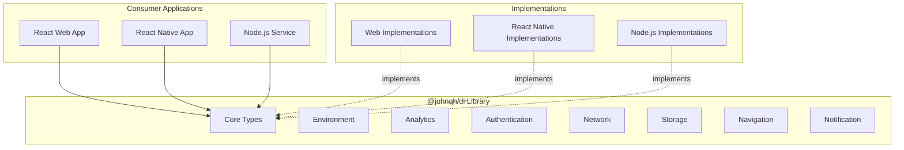

# Architecture Documentation

## System Design Overview



## Core Architecture Principles

### 1. Interface Segregation
Each domain has its own focused interface module, preventing unnecessary dependencies and maintaining clean boundaries.

### 2. Dependency Inversion
High-level modules (consumer apps) depend on abstractions (interfaces), not concrete implementations.

### 3. Platform Agnosticism
All interfaces are designed to work across web, mobile, and server environments without modification.

## Module Architecture

### Core Types Module (`src/types.ts`)
```typescript
Purpose: Foundation types and enums used across all modules
Dependencies: None
Exports:
  - Platform enum
  - BaseResponse type
  - ErrorResponse interface
  - Common utility types
```

### Environment Module (`src/env.ts`)
```typescript
Purpose: Application configuration and environment management
Dependencies: types.ts
Key Interfaces:
  - EnvProvider: Environment variable access
  - AppConfig: Application configuration
  - FeatureFlags: Feature toggle management
```

### Analytics Module (`src/analytics/`)
```typescript
Purpose: Event tracking and analytics
Dependencies: types.ts
Architecture:
  - Event-driven design
  - Platform-agnostic event types
  - Extensible metadata system
Key Interfaces:
  - AnalyticsProvider
  - EventTracker
  - UserProperties
```

### Authentication Module (`src/auth/`)
```typescript
Purpose: Authentication and authorization
Dependencies: types.ts
Architecture:
  - Multi-provider support (OAuth, Email, Wallet)
  - Session management
  - Token refresh patterns
Key Interfaces:
  - AuthProvider
  - SessionManager
  - TokenStorage
```

### Network Module (`src/network/`)
```typescript
Purpose: HTTP client abstraction
Dependencies: types.ts
Architecture:
  - Request/Response generics
  - Interceptor pattern support
  - Platform-agnostic error handling
Key Interfaces:
  - NetworkClient
  - RequestInterceptor
  - ResponseTransformer
```

### Storage Module (`src/storage/`)
```typescript
Purpose: Data persistence abstraction
Dependencies: types.ts
Architecture:
  - Key-value storage pattern
  - Encryption support hooks
  - Async-first design
Key Interfaces:
  - StorageProvider
  - SecureStorage
  - CacheProvider
```

### Navigation Module (`src/navigation/`)
```typescript
Purpose: Routing and navigation
Dependencies: types.ts
Architecture:
  - Stack-based navigation
  - Deep linking support
  - State persistence
Key Interfaces:
  - Navigator
  - RouteConfig
  - NavigationState
```

### Notification Module (`src/notification/`)
```typescript
Purpose: Push and local notifications
Dependencies: types.ts
Architecture:
  - Permission management
  - Scheduling support
  - Platform-specific payloads
Key Interfaces:
  - NotificationProvider
  - PermissionManager
  - NotificationScheduler
```

## Design Patterns

### 1. Generic Provider Pattern
```typescript
interface Provider<T, K = string> {
  get(key: K): Promise<T>;
  set(key: K, value: T): Promise<void>;
}
```
Used for: Storage, Cache, Configuration

### 2. Event Emitter Pattern
```typescript
interface EventEmitter<T> {
  on(event: string, handler: (data: T) => void): void;
  off(event: string, handler: (data: T) => void): void;
  emit(event: string, data: T): void;
}
```
Used for: Analytics, Authentication state changes

### 3. Factory Pattern
```typescript
interface Factory<T, C = unknown> {
  create(config: C): T;
}
```
Used for: Creating configured instances

### 4. Adapter Pattern
```typescript
interface Adapter<S, T> {
  adapt(source: S): T;
}
```
Used for: Platform-specific adaptations

## Type System Architecture

### Generic Constraints
- Use `unknown` instead of `any` for maximum type safety
- Apply generic constraints where type relationships exist
- Prefer union types over enums for extensibility

### Type Composition
```typescript
// Base types
type ID = string;
type Timestamp = number;

// Composed types
interface Entity {
  id: ID;
  createdAt: Timestamp;
  updatedAt: Timestamp;
}

// Extended interfaces
interface User extends Entity {
  email: string;
  name: string;
}
```

## Error Handling Architecture

### Error Types
```typescript
interface BaseError {
  code: string;
  message: string;
  timestamp: number;
}

interface NetworkError extends BaseError {
  status?: number;
  endpoint?: string;
}

interface ValidationError extends BaseError {
  field?: string;
  constraint?: string;
}
```

### Error Propagation
- All async operations return Promise with typed errors
- Use discriminated unions for error types
- Include error recovery strategies in interfaces

## Testing Architecture

### Test Structure
```
tests/
├── unit/           # Interface contract tests
├── integration/    # Multi-module interaction tests
└── mocks/         # Shared mock implementations
```

### Mock Strategy
1. Create minimal viable mocks
2. Test interface contracts, not implementations
3. Use in-memory implementations for testing
4. Validate type safety through compilation

## Performance Considerations

### Interface Design
- Keep interfaces small and focused (Interface Segregation Principle)
- Use async patterns for I/O operations
- Support cancellation via AbortSignal
- Enable batching where applicable

### Type Performance
- Avoid deeply nested generic types
- Use type aliases for complex types
- Minimize conditional types
- Prefer interfaces over type aliases for objects

## Security Architecture

### Interface Security
- Never expose sensitive data in interfaces
- Support encryption hooks in storage interfaces
- Include authentication in network interfaces
- Validate input types at compile time

### Best Practices
1. Use opaque types for sensitive data
2. Support secure storage interfaces
3. Include permission checks in interfaces
4. Enable audit logging hooks

## Extensibility

### Adding New Modules
1. Create new directory under `src/`
2. Define interface file
3. Export from `src/index.ts`
4. Add comprehensive tests
5. Update documentation

### Extending Interfaces
```typescript
// Base interface
interface BaseProvider {
  initialize(): Promise<void>;
}

// Extended interface
interface CachingProvider extends BaseProvider {
  cache: Map<string, unknown>;
  invalidate(): void;
}
```

## Migration Strategy

### Version Migration
- Use deprecation markers
- Maintain backward compatibility
- Provide migration guides
- Use semantic versioning

### Breaking Changes
1. Mark as deprecated in version N
2. Provide alternative in version N
3. Remove in version N+2
4. Document in CHANGELOG

## Dependencies and Constraints

### Zero Runtime Dependencies
- No external packages in production
- DevDependencies only for development
- Self-contained type definitions
- No polyfills required

### Platform Constraints
- TypeScript 4.5+ required
- ES2020 target minimum
- React 18+ for React apps
- Node.js 18+ for server apps

## Future Architecture Considerations

### Planned Enhancements
1. WebSocket abstraction interfaces
2. GraphQL client interfaces
3. State management interfaces
4. Worker thread interfaces
5. WebRTC abstractions

### Scalability
- Modular structure supports growth
- Each domain independently versioned
- Backward compatibility maintained
- Tree-shaking friendly exports

## AI Integration Points

### AI-Friendly Design
1. Clear interface boundaries
2. Comprehensive JSDoc comments
3. Consistent naming patterns
4. Example implementations in tests

### AI Assistant Hooks
- `@ai-context` markers in code
- Template patterns in EXAMPLES.md
- Clear architectural documentation
- Consistent error messages